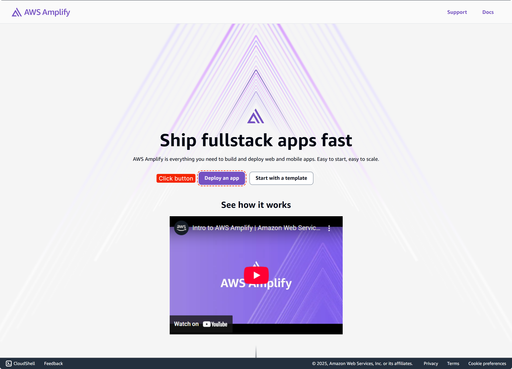
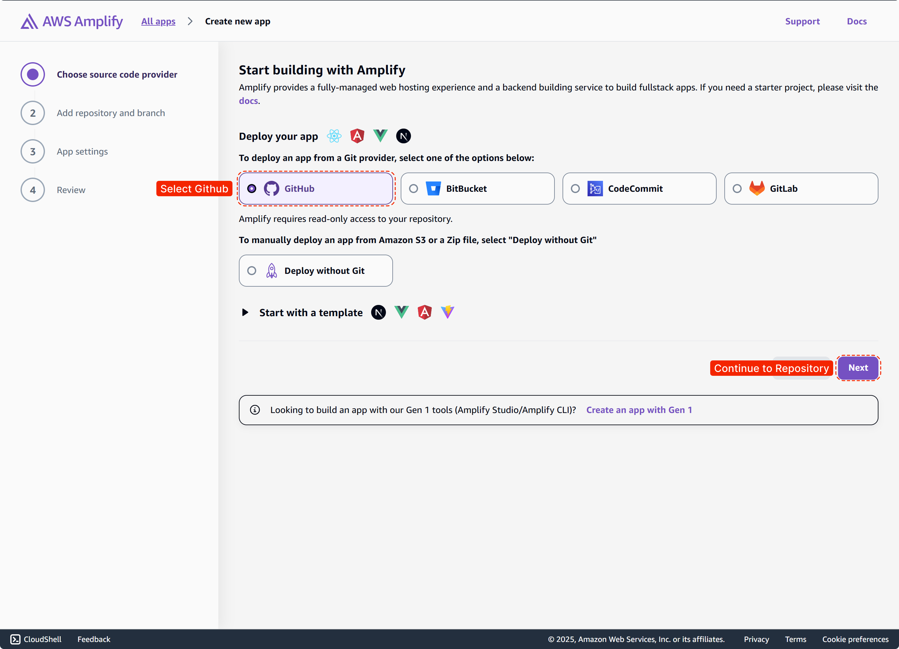
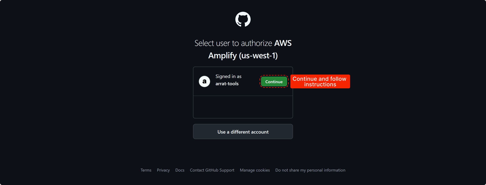
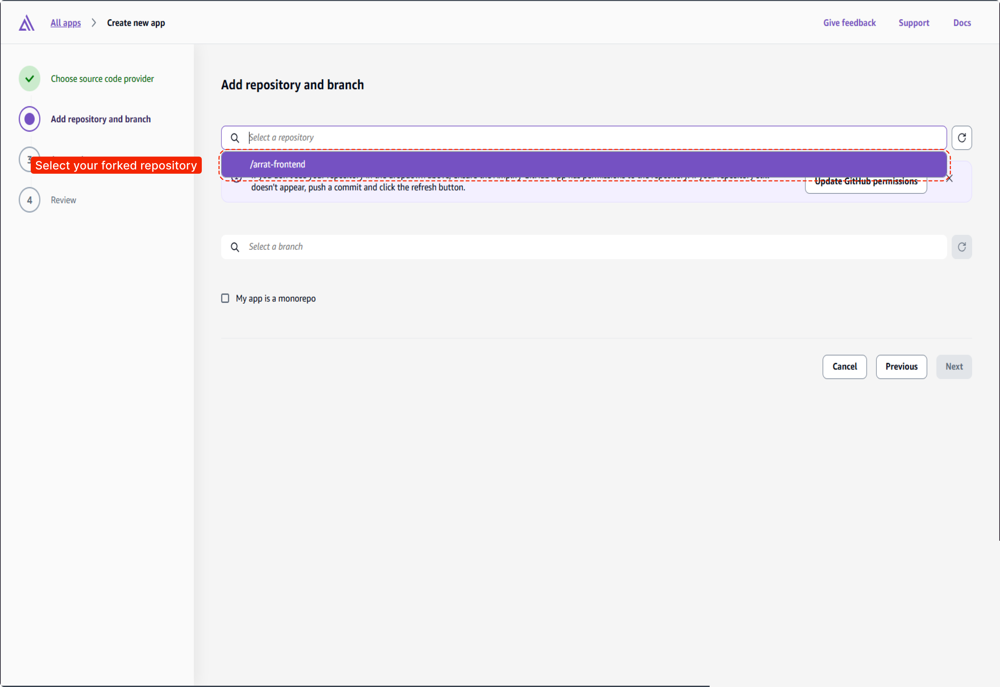
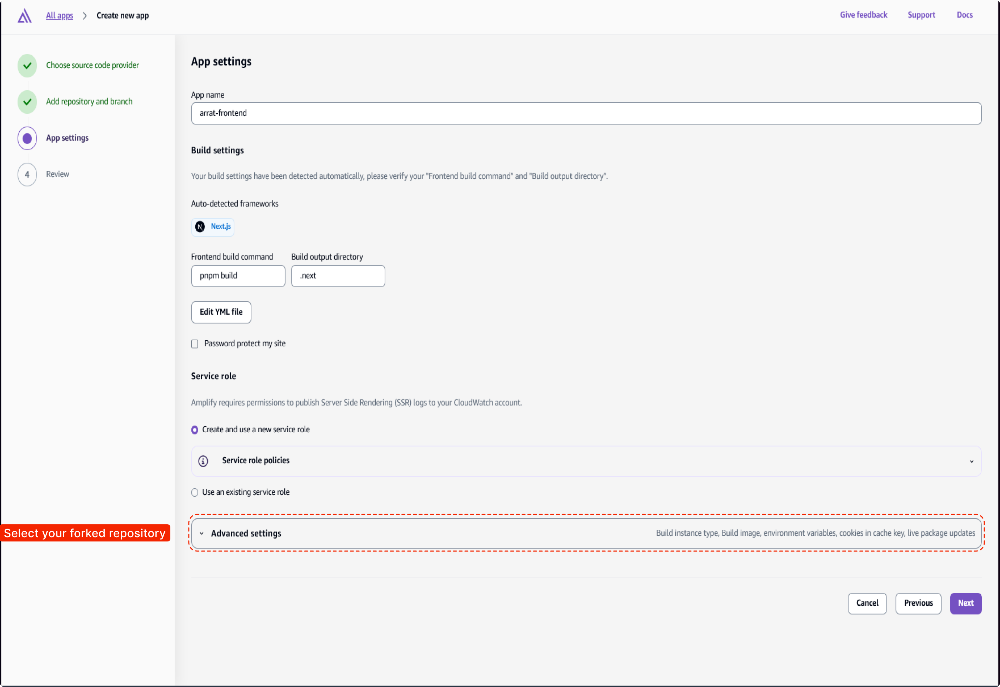

# Overview

ARRAT is an **autonomous vehicle readiness** test collecting data along _public roadways_. Each sample goes through
ML analysis to determine a readiness score for that section of the drive. Navigate through the drive with this interactive map to
drill into each sample's audit information.

1. [Technologies Used.](#tech)
2. [Setting Up Development Environment.](#setup)
3. [Project Structure.](#proj)
4. [Connecting to the Backend.](#backend)
5. [Deployment Guide.](#deploy)
6. [Troubleshooting and FAQs.](#faq)
7. [License.](#license)

<a name="tech"></a>

## 1. Technologies Used

This section lists the technologies used in the project and provides a brief description of each.

### Scaffolding

- **`AWS Amplify`**: [Backend services and cloud infrastructure.](https://aws.amazon.com/amplify/)
- **`Next.js`**: [Server-side rendering and frontend development.](https://nextjs.org/)
- **`tRPC`**: [API data layer](https://trpc.io/)
- **`zod`**: [Data schema validation](https://zod.dev/)

### Styling

- **`Shadcn ui`**: [React Component Styling](https://ui.shadcn.com/)
- **`Radix ui`**: [Headless React Components](https://www.radix-ui.com/)
- **`Recharts`**: [React Charting Library](https://recharts.org/en-US/)
- **`Tailwind CSS`**: [Site Theming](https://recharts.org/en-US/)

### GIS

- **`Leaflet`**: [Map Rendering Engine](https://leafletjs.com/)
- **`react-leaflet`**: [React Leaflet Bindings](https://react-leaflet.js.org/)

<a name="setup"></a>

## 2. Setting Up Development Environment

### Prerequisites

Ensure you have the following installed:

- Node.js (version 18.17.0 or higher)
- pnpm (`npm i -g pnpm`)
- AWS CLI, Amplify CLI
- Git

### Steps

1. **Clone the Repository:**

   ```bash
   git clone git@github.com:arrat-tools/frontend.git
   cd frontend
   ```

2. **Install Dependencies:**

   ```bash
   pnpm install
   ```

3. **Set Up Environment Variables:**

Create a `.env` file in the root directory and add necessary environment variables. Refer to `.env.example` for the required variables.

3. **Set Up Public Folder:**

Download generated files (i.e., `unit*/frames.json`, `session.json (may need to be renamed from session.geojson)`, `session_map.json`) from AWS S3 outputs and save to the _/public/input/_ folder.

5. **(Optional) Deploy backend sandbox:**

   If Amplify Backend services are already deployed, you can download the deployed `amplify_outputs.json` file, add it to the repository, and skip the following code. Learn more about the `amplify_outputs.json` file on the [AWS Amplify Gen2 docs](https://docs.amplify.aws/react/reference/amplify_outputs/).

   ```bash
   # Setup up and deploy sandbox services
   npx ampx sandbox --profile <your profile here> --outputs-out-dir ./src/
   # or
   npx ampx generate --app-id <your app id here>
   ```

6. **Run the Development Server:**

   ```bash
   pnpm dev
   ```

### Additional Commands

1. **Run Unit Tests:**

   ```bash
   pnpm test
   ```

2. **Run Linter:**

   ```bash
   pnpm lint
   ```

<a name="proj"></a>

## 3. Project Structure

Provide an overview of the project structure, including key directories and files.

```
/project-name
  ├── assets/readme
  ├── public
  │   ├── mock
  │   ├── input
  │   │   └── unit*
  ├── src
  │   ├── app
  │   ├── components
  │   ├── config
  │   ├── hooks
  │   ├── lib
  │   ├── server
  │   |   └── api
  │   ├── styles
  │   ├── trpc
  │   └── types
  ├── .gitignore
  ├── .eslintrc.json
  ├── .prettierrc
  ├── package.json
  ├── README.md
  ├── .env.example

```

---

### /src

- /app - Next.js application pages and route handlers
- /components - Reusable UI React components used on pages
- /config - Basic site configuration (e.g., app routes, site metadata, color theme
- /server/api - tRPC API configuration, routes, and procedures
- /styles - Base styles and theming

### /public

**\*\*\*** **_Needs to be added manually_**

- /mock
  - /placeholder.png - Image loading placeholder (lower resolution for faster FCP)
- /favicon.ico - Site favicion
- /input
  - /configuration.json - **\*\*\*** Configuration file containing all known sessions.
  - /session_data.json - **\*\*\*** Configuration file containing session file names, paths, user defined inputs, etc for all sessions.
  - /session.json - **\*\*\*** Generated file containing geojson (Loaded/rendered on map)
  - /session_map.json - **\*\*\*** Generated file containing map metadata
  - /unit\*
    - /frames.json - **\*\*\*** Input file matching keyframes to segments

### /assets/readme

- /Step {1,2,3,4}.png - Images used in README file

### /.env.example

List of environment variables used throughout the application for referencing external services. Used to setup live **`*.env*`** file

**Tilesets**

- NEXT_PUBLIC_TILE_SET_ATTRIBUTION - Default tileset attribution shown at bottom of map.
- NEXT_PUBLIC_TILE_SET_URL - Default tileset used when rendering map.
- NEXT_PUBLIC_SATELLITE_TILE_SET_ATTRIBUTION - Satellite tileset attribution shown at bottom of map.
- NEXT_PUBLIC_SATELLITE_TILE_SET_URL - Satellite tileset used when rendering map.

**Images (AWS references)**

- SERVER_IMAGES_URL - Full URL of service providing images .
- SERVER_IMAGES_REMOTE_PATTERN_PROTOCOL - Expected protocol (DEFAULT: https).
- SERVER_IMAGES_REMOTE_PATTERN_HOST_NAME - Expected host name of service.
- SERVER_IMAGES_REMOTE_PATTERN_PATHNAME - Expected path name of images .

### /README.md

Basic project documentation. Including project description, local development, necessary deployment steps, etc.

<a name="backend"></a>

## 4. Connecting to the Backend

### Amplify Gen2 Configuration

Backend configuration live within the `/amplify` directory represented as typescript files. Pushing code with amplify automated builds will trigger backend services to deploy any updates or added services. Cloud services are automatically synced with these configuration files. Add or modify files to update any needed backend services your project needs. For more information on this, go to the [AWS Amplify Gen2 Docs](https://docs.amplify.aws/).

<a name="deploy"></a>

## 5. Deployment Guide

### Deploying to AWS Amplify

**Getting started**

1. Navigate to Amplify console and press _create new app_



**Choose your git provider**

1. Select your git provider
2. Follow their permissions guide and remember to give permission to access the ARRAT repo




**Selecting repository and branch**



**Build settings**

1. Choose application name
2. Add `pnpm build` for build script (if needed)
3. Navigate to _Advanced Settings_
4. Add _Environment Variables_



```bash
# Standard Open Street Map tile set
NEXT_PUBLIC_TILE_SET_ATTRIBUTION=&copy; <a href="https://www.openstreetmap.org/copyright">OpenStreetMap</a> contributors
NEXT_PUBLIC_TILE_SET_URL=https://{s}.tile.openstreetmap.org/{z}/{x}/{y}.png

# Esri Satellite tile set
NEXT_PUBLIC_SATELLITE_TILE_SET_ATTRIBUTION=Tiles &copy; Esri &mdash; Source: Esri, i-cubed, USDA, USGS, AEX, GeoEye, Getmapping, Aerogrid, IGN, IGP, UPR-EGP, and the GIS User Community
NEXT_PUBLIC_SATELLITE_TILE_SET_URL=https://server.arcgisonline.com/ArcGIS/rest/services/World_Imagery/MapServer/tile/{z}/{y}/{x}

SERVER_IMAGES_URL= # Add your server images url here (e.g., https://images.<your endpoint>.com)
SERVER_IMAGES_REMOTE_PATTERN_PROTOCOL=https # Update to your server protocol
SERVER_IMAGES_REMOTE_PATTERN_HOST_NAME= # Add your server host name here (e.g., images.<your endpoint>.com/)
SERVER_IMAGES_REMOTE_PATTERN_PATHNAME=/**/* # Add your server path name here (e.g., /**/*)

SERVER_SESSION_API_BASE_URL= # Add your `WebEndpoint` API deployment URL from `deploying the api step`.
```

_Read more about Next.js `remote patterns` [here](https://nextjs.org/docs/14/app/api-reference/components/image#remotepatterns)_

### Continuous Deployment

Set up continuous deployment through AWS Amplify Console by connecting your repository.

### Custom Domain Configuration

1. **Add Custom Domain:**
   Follow the steps in the AWS Amplify Console to add a custom domain to your project.
2. **Update DNS Records:**
   Update your DNS provider with the necessary records provided by AWS Amplify.

<a name="faq"></a>

## 6. Troubleshooting and FAQs

### Common Issues

- **Error: Amplify push fails**
  - **Solution:** Ensure that your AWS CLI is properly configured with the correct credentials and region.

### FAQs

- **How do I update dependencies?**
  - **Answer:** Run `pnpm update` to update your project dependencies.

### Additional Troubleshooting

- **How do I debug authentication issues?**
  - **Solution:** Check the AWS Amplify documentation and ensure your backend configurations are correct.
- **How do I handle CORS issues?**
  - **Solution:** Configure CORS settings in the AWS Amplify Console and update your API settings accordingly.

For more troubleshooting tips, refer to the AWS Amplify Documentation.

<a name="license"></a>

## 8. License

This project is licensed under the MIT-0 License. See the LICENSE file for details.
